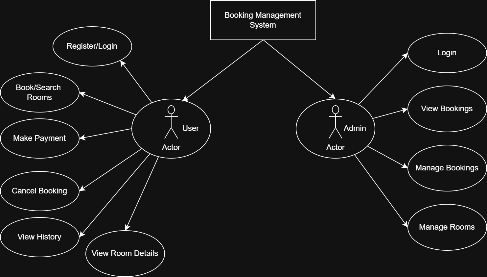

# 📘 Requirement Analysis in Software Engineering

## Overview

This repository presents a comprehensive walkthrough of the **Requirement Analysis Phase** for a simulated **Booking Management System** project. It captures the thought process, techniques, and documentation involved in translating business needs into clear, actionable software requirements.

---

## 🧠 Understanding Requirement Analysis

## Types of Requirements

**Requirement Analysis** refers to the process of collecting, interpreting, and documenting the expectations and specifications of users and stakeholders for a software product. As a vital step in the Software Development Life Cycle (SDLC), it ensures alignment between business goals and technical implementation.

A well-executed requirement analysis helps:

- Clarify the system's purpose and functionalities.
- Identify potential limitations and risks early.
- Serve as a reference for development, testing, and deployment.

---

## ❓ Why is Requirement Analysis Critical?

Here are three reasons why requirement analysis is a cornerstone of software projects:

1. **Ensures Alignment**

   - Helps all stakeholders share a unified vision of what the final product should achieve.

2. **Reduces Development Issues**

   - Minimizes ambiguities, miscommunications, and rework by catching issues early in planning.

3. **Informs Subsequent Phases**

   - Provides detailed input for system architecture, coding, and quality assurance.

---

## 🔍 Major Components of Requirement Analysis

Key Activities in Requirement Analysis

- **Requirements Collection**

  - Engaging users, domain experts, and other stakeholders to gather their input via interviews, forms, or group discussions.

- **Requirement Elaboration**

  - Expanding on the collected information to uncover hidden needs or potential improvements.

- **Requirements Documentation**

  - Organizing requirements in clear, structured formats such as Software Requirement Specification (SRS) documents or annotated READMEs.

- **Requirement Analysis & Modeling**

  - Evaluating feasibility and consistency. Also includes visual models like use case diagrams.

- **Requirement Verification**

  - Confirming that the requirements are understood, complete, and approved by stakeholders.

---

## 📂 Classification of Requirements

Requirements are broadly categorized as:

### ✅ Functional Requirements

These outline **what the system will do** — the features and services offered to users.

**Examples in the Booking System:**

- Customers can reserve a hotel room.
- Administrators can approve, update, or delete bookings.
- Customers receive email alerts upon successful booking.

### ⚙️ Non-functional Requirements

These describe **how the system will perform**, focusing on quality aspects.

**Examples:**

- Web pages should load within 2 seconds.
- Sensitive data must be transmitted securely.
- The platform should support at least 1,000 concurrent users.

---

## 🧾 Use Case Diagrams

Use case diagrams offer a high-level overview of the system’s functionality from the user’s perspective.

**Advantages:**

- Define boundaries and interactions clearly.
- Help stakeholders visualize user flows.
- Support developers in identifying core system features.

_The diagram above shows typical user interactions like making, updating, and canceling bookings. Created with [Draw.io](https://draw.io)._

---

## ✅ Acceptance Criteria

These are testable requirements that a feature must fulfill to be accepted by clients or users.

**Purpose:**

- Define when a feature is ready for release.
- Clarify expectations and reduce ambiguity.
- Support validation through QA and testing.

**Example – Booking Checkout Flow:**

- ✅ Display booking summary (room, dates, cost).
- ✅ Allow users to securely enter and confirm payment.
- ✅ Provide confirmation message and email post-payment.
- ✅ Ensure integration with a secure payment processor.

---

## 🎯 Final Thoughts

Through this project, I gained valuable experience in:

- Capturing and formalizing system requirements.
- Differentiating between functional and non-functional aspects.
- Designing use case diagrams to visualize scope.
- Writing solid acceptance criteria to guide development.

This approach demonstrates a structured, industry-standard method for planning software systems and forming the backbone of successful project execution.
